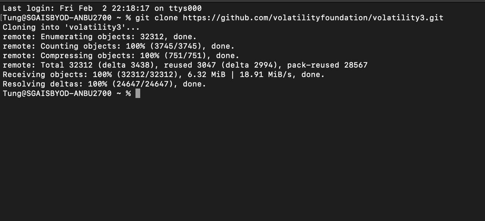

# tetctf2024misc
                            **TET & 4n6 misc(cannot solve but I write what i did)**

## Description:


## What I did:

First I downloaded the file in this challenge and unzipped some files inside.


Then after I unzipped the zip file I got the raw file and I open it with terminal using strings and see the flag 2 and other fake ip and port(which I think is the IP that I am finding)


So i saw .ad1 file so I researched and find that can use FTK imager to open and extract so I downloaded it but it was .exe file so I just downloaded wine using brew
```
$brew install --cask xquartz
$brew install --cask wine-stable
```
so I open the ftk imager

click the image file and choose the ad1 file

and you see the directory. Then I just downloaded all the files and look for something that looked like malware and I found this thing that has malware in the file name

I thought that was malware but when I researched it, it a safe one so I researched more

After a few hours, I found the mimikatz file (Mimikatz is a tool that hackers and security professionals commonly use to extract sensitive information, such as passwords and credentials) and other files that .lnk(windows shortcut). I see that inside the files have some directories that point to some docx, zip,... but I don't know what to do.


Then I found some other log file but I had no idea about how to use it.

After that, I think that there is some files on the directory in .lnk files so I think I need to recover files and try some.I download a tools name Foremost and start to recovery file but there is nothing again.

### The last things I do
So I just researched again and found [volatility3](https://volatility3.readthedocs.io/en/stable/).I read this [site](https://www.varonis.com/blog/how-to-use-volatility) and know how to use it. I try lots of things and at the windows.netscan, I cant use it.



<p align="center">So I give up...because it was almost 4 am.


# That all this is the write up for this [challenge](https://ctf.krauq.com/tetctf-2024)


